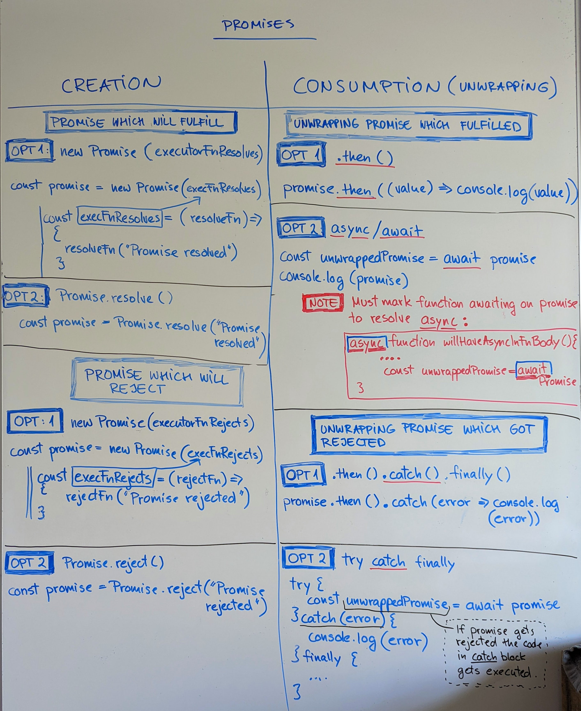

<!-- START doctoc generated TOC please keep comment here to allow auto update -->
<!-- DON'T EDIT THIS SECTION, INSTEAD RE-RUN doctoc TO UPDATE -->
**Table of Contents**  *generated
with [DocToc](https://github.com/thlorenz/doctoc)*

- [Promises examples](#promises-examples)
  - [Run the project](#run-the-project)
  - [Change the port](#change-the-port)
  - [Run unit tests](#run-unit-tests)
  - [Being able to use top level await](#being-able-to-use-top-level-await)

<!-- END doctoc generated TOC please keep comment here to allow auto update -->

## Run the project

1. `npm install` to install all the repo dependencies.
2. `npm run start` to start the app. This script deletes Webpack generated
   `dist/` folder and then uses Webpack to regenerate it again.

## Change the port

The project will start running on port 9000. If you want to change the port
open `webpack.config.js` and find the `port:9000` and change it from there.

```json
module.exports = {
  ...
  devServer: {
    static: {
      directory: path.join(__dirname,
      "dist"
      )
    },
    compress: true,
    port: 9000
  }
}
```

## Run unit tests

- `npm run test` if you want to run one test.
- `npm run test-watch` if you want to keep running the tests.

## Being able to use top level await

In order to be able to use top level `await` in `index.ts` you have to do 2
things:

1. **Webpack:** Set `futureDefaults: true` inside `experiments` in Webpack
   config file.

[More info on it on Webpack docs.](https://webpack.js.org/configuration/experiments/#experimentsfuturedefaults)

**webpack.config.js**

```
  module.exports = {
    //...
    experiments: {
      futureDefaults: true,
    },
  };

```

2. **TypeScript:** In `tsconfig.json` file change target to ES2017 and module
   ESNext.

```json
{
  ...
  "compilerOptions": {
    "target": "ES2017",
    "module": "ESNext",
    ...
  }
}
```

# Promises examples

This repo shows many ways you can make and unwrap promises. Check out `index.ts`
. Uncomment the functions on `index.ts` to see how to make Promises and
their outcomes.

```typescript
main1();
// await main2();
// await main3();
// await main4();
```



## What is a Promise?
- Promise is a JavaScript's standard built-in object. Find out other [standard built-in objects on MDN](https://developer.mozilla.org/en-US/docs/Web/JavaScript/Reference/Global_Objects).
- Promise object has methods like reject(), resolve(), race() etc. we can call to do different
  things with the returned promise. 

## Overview of Promises

- Promises have two sections to think about:
  - Promise creation/production
  - Promise unwrapping/consuming

## Promise creation

- Promise creation uses things like `new Promise()`, `Promise.resolve()`,
  `Promise.reject()`.

## Promise consumption

- Promise consumption uses things like `async/await`, `.then()`,
  `try/catch/finally blocks`

## Use cases for making a Promise

- Why do we need Promises?
- [Example of how to wrap html script loading inside a Promise](https://javascript.info/promise-basics#loadscript)

## Promises with `then` and with `async/await`

- You can unwrap Promises using `.then()`
- You can unwrap Promises using `async/await` syntax.


- Both of these happen when Promise is being unwrapped stage (not at the Promise
  creation stage).

## Making Promises

- To make a Promise use `new Promise()` constructor. It takes an executor
  function. An executor function takes two functions as arguments: resolveFn and
  rejectFn.
- If you only care about successful Promise completions, omit the rejectFn.
- If you only are about the rejected Promise completions, write (**_**,
  rejectFn).


- If you don't wrap resolveFn and/or rejectFn into `setTimeout()` function, the
  Promises will return immediately. The resolveFn will return a Promise that has
  a state "fulfilled" and rejectFn will return a Promise that has a state
  "rejected".

``` typescript
  const promise = new Promise((resolveFn, rejectFn) => {
  
    // If you only care about successful Promise completions:
  
    resolveFn(payloadToReturn) // you can also wrap this into setTimeout(). resolveFn()/resolve() is provided by the Promise constructor.
    
    // If you only care about errored out Promise completions:
    rejectFn("error message to return")  // rejectFn()/reject() is provided by the Promise constructor.

    // -------------------------------------
    
    // Want to imitate a network call? Wrap resolveFn or rejectFn into setTimeout() 
    setTimeout(() => resolveFn(payloadToReturn), 2000);
  })
```

## Little more about resolveFn() and rejectFn()
- `resolveFn()` and `rejectFn()` are methods on the Promise object.

### resolveFn()
- resolveFn(value/payload) is called when the Promise is resolved.
- **From the Promise src docs:** resolveFn(value) takes one argument `value` (I referred to value as
  `payloadToReturn` in the above sample code) with type `T | PromiseLike<T>`. You can read more details
  by pressing `Mod + b` on the Promise on your keyboard (this doesn't work for everyone. This is my
  keyboard configuration). 

### rejectFn()
- rejectFn(reason) is called when the Promise is rejected.
- rejectFn(reason) takes a single argument `reason` with type `any`. 

## Another way to make Promises

- We can use Promise.resolve() and Promise.reject() methods.
- **Promise.resolve(payload)**
  - `PromiseState` will be immediately "fulfilled"
    and `PromiseResult` will be the payload.
- **Promise.reject**("error message" or new Error("error message")**)**
  - `PromiseState` will be immediately "rejected" and `PromiseResult` will be
    the error message.

## Consuming Promises

- As mentioned above there are two ways to consume Promises: `async/await`
  or/and `.then()`

`async/await`

1. Firstly, we make a promise. Check out the `main4()` function in `index.ts`
  file.

```typescript
const promiseIMade = new Promise(executorFn)
```

2. `promiseIMade` returns a type Promise. Remember this pattern: when we have a
  promise, we have to unwrap it to get the value. But we can only unwrap a
  Promise that has changed it's `PromiseState` from "pending" to "fulfilled"
  or "rejected".


3. We need to **wait for the Promise state to change**. That's when we use the
  `await` keyword.

```typescript
const unwrappedPromise = await promiseIMade
```

4. If the promise fulfilled, then we can use `unwrappedPromise` value. If 
   the promise got rejected, we can do something with the error we got. 
   
- Note: the error we get comes from the `rejectFn()` that we write in 
   `executonFn` we passed to `new Promise(executorFn)` when we made the 
  Promise in the first place.

## Consuming Promises with .allSettled()

- allSettled() will return an array of Promises. Promises can either resolve 
or reject. 
- This is a fast way to fetch for data parallel!!!
